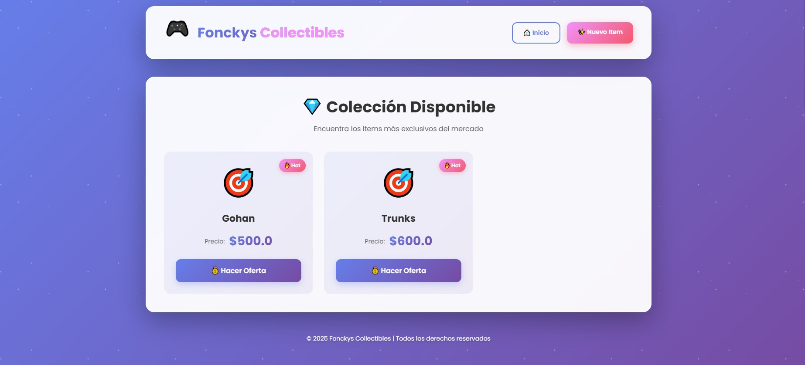
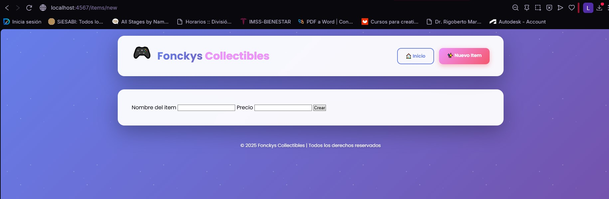
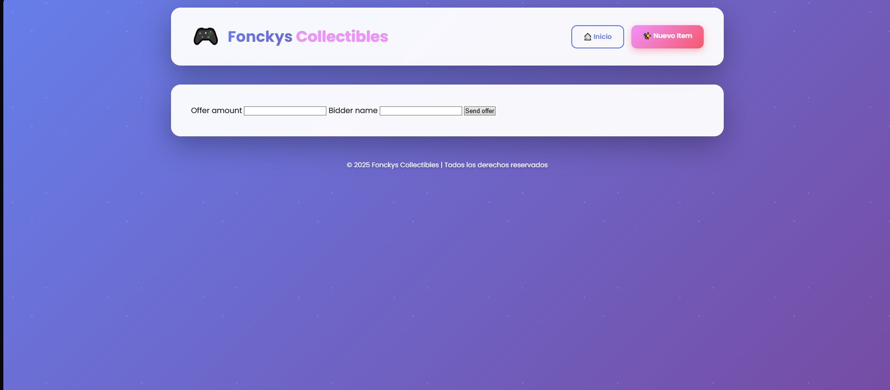
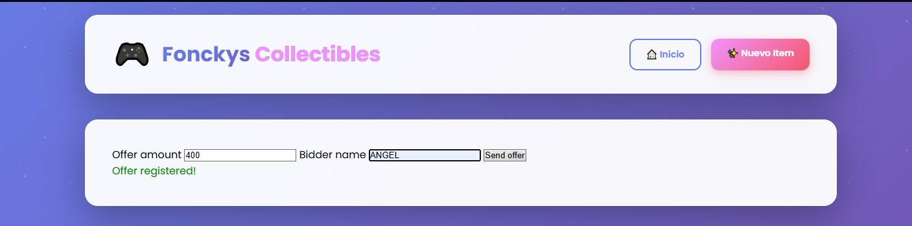
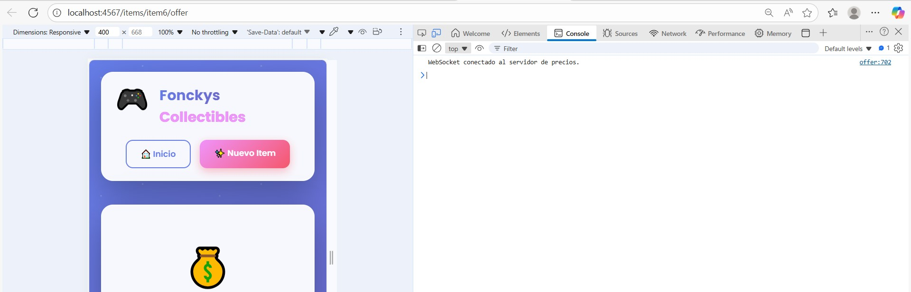
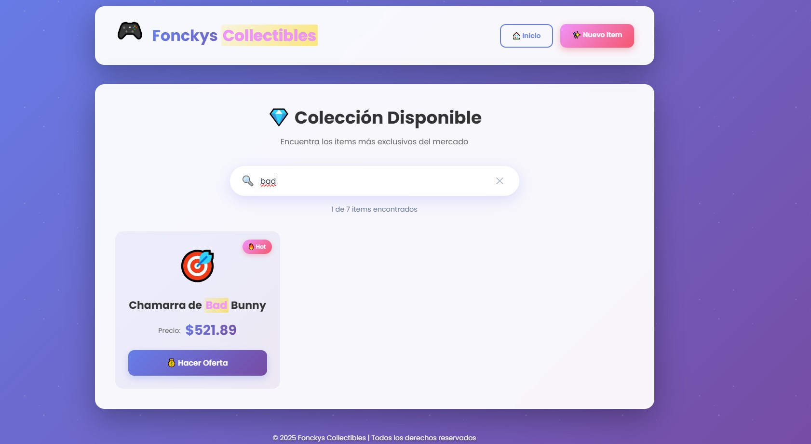
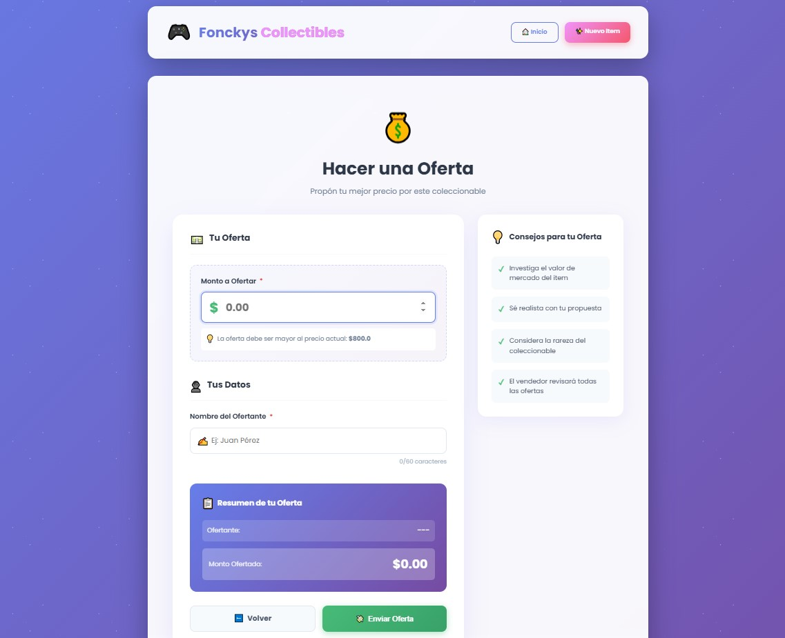
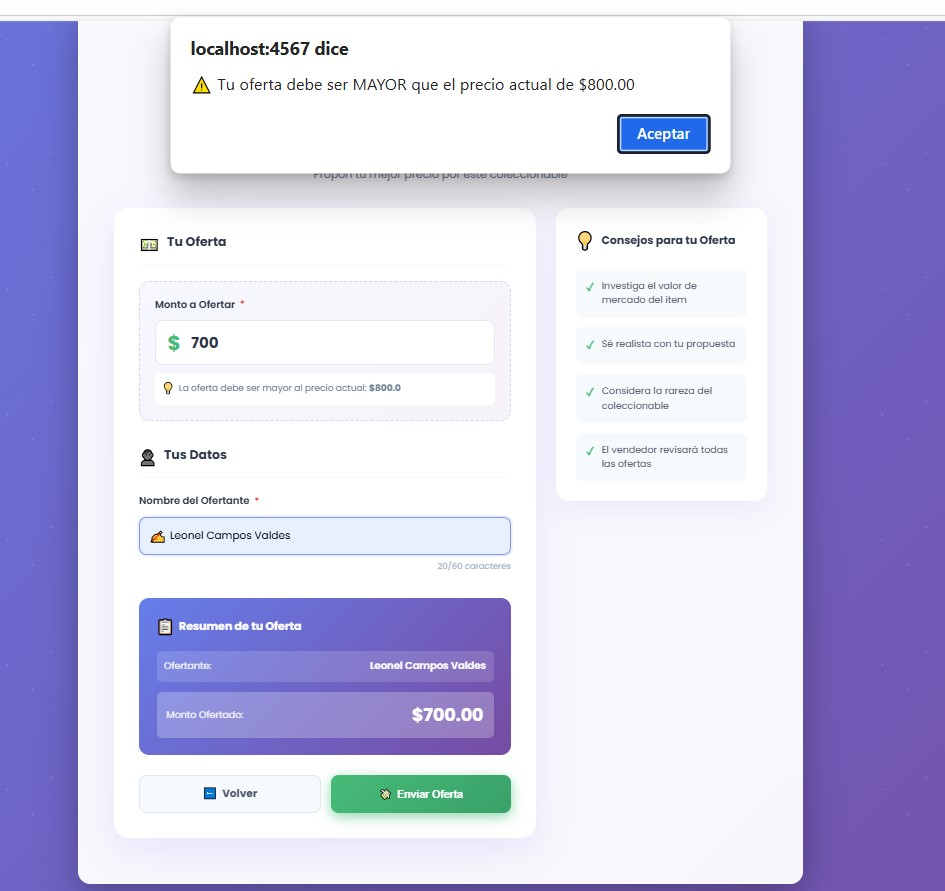
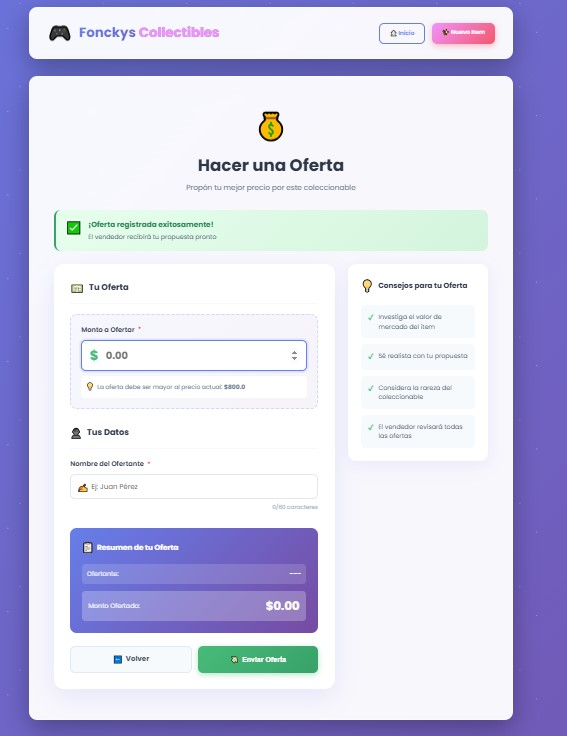
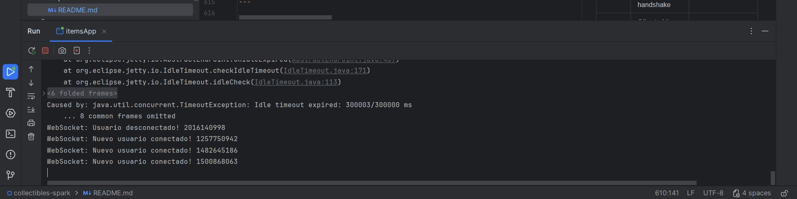

# 🧾 Collectibles Spark API

## 🏗️ Project Overview

**Collectibles Spark API** is a full-stack web application developed in **Java** using the **Spark Framework**, designed to manage collectible items and users in an interactive online marketplace.

This project evolved through three development sprints:
- **Sprint 1**: RESTful API with complete CRUD operations
- **Sprint 2**: Dynamic web interface with Mustache templates and responsive design
- **Sprint 3**: Real-time features with WebSockets and client-side filtering

The application now provides a **modern, interactive experience** with instant search filtering, live price updates via WebSockets, and dynamic form validation—demonstrating professional full-stack Java development capabilities.

---

## 🧠 Competence and Learning Integration

This project demonstrates the **implementation of Spark Framework** within a Maven-based environment, applying Java web development principles to create modular, maintainable, and scalable applications.

It integrates the following areas of knowledge:

- **Java OOP principles** (encapsulation, classes, and methods)
- **HTTP routing and REST design**
- **API development using Spark Java**
- **WebSocket real-time communication**
- **Client-side JavaScript for dynamic UX**
- **Dependency management with Maven**
- **Logging using Logback**
- **Data serialization with Gson**
- **Template rendering with Mustache**

Through this challenge, I learned to create a complete web application from scratch, manage dependencies, configure routes, implement real-time features, and handle both server-side and client-side logic independently — reflecting **C2-level mastery** as defined in the evaluation rubric.

---

## ⚙️ Technical Configuration

### 🧩 Maven Setup

The project was configured as a Maven application with the following dependencies:

```xml
<dependencies>
  <dependency>
    <groupId>com.sparkjava</groupId>
    <artifactId>spark-core</artifactId>
    <version>2.9.4</version>
  </dependency>

  <dependency>
    <groupId>com.google.code.gson</groupId>
    <artifactId>gson</artifactId>
    <version>2.10.1</version>
  </dependency>

  <dependency>
    <groupId>ch.qos.logback</groupId>
    <artifactId>logback-classic</artifactId>
    <version>1.2.13</version>
  </dependency>
</dependencies>
```

✅ **Why Spark?**  
Because it eliminates XML configuration files and boilerplate code, allowing fast API setup using concise Java functions.

✅ **Why Gson?**  
To serialize and deserialize JSON responses, enabling consistent REST communication.

✅ **Why Logback?**  
To log HTTP activity and exceptions, enhancing debugging and traceability.

---

## 🚀 Running the Project

### ▶️ From IntelliJ IDEA
1. Open `App.java`.
2. Run → **Run 'App.main()'**
3. Access `http://localhost:4567/items`

### ▶️ From Terminal
```bash
mvn clean package
java -jar target/collectibles-spark-0.1.0.jar
```

Server starts at:
```
== Spark has ignited ...
>> Listening on 0.0.0.0:4567
```

---

## 🔀 Route Definition

According to Spark's documentation, each route consists of **three parts: a verb, a route, and a callback**.

| HTTP Verb | Route | Description |
|------------|--------|--------------|
| `GET` | `/users` | Retrieves all users |
| `GET` | `/users/:id` | Retrieves a user by ID |
| `POST` | `/users/:id` | Creates a new user |
| `PUT` | `/users/:id` | Updates user information |
| `OPTIONS` | `/users/:id` | Checks if a user exists |
| `DELETE` | `/users/:id` | Deletes a specific user |
| `GET` | `/items` | Displays all collectible items (web view) |
| `GET` | `/items/new` | Form to create new item |
| `GET` | `/items/:id/offer` | Opens offer submission form |
| `POST` | `/items/:id/offers` | Submits and validates new offer |
| `WS` | `/price-updates` | WebSocket endpoint for real-time price updates |
| `GET` | `/health` | Health check route (returns `OK`) |

Each route returns either a **JSON-formatted response** or renders a **Mustache template**, ensuring lightweight data handling and dynamic UI rendering.

---

## 💡 Example Requests

### 🧠 Create User
```bash
curl -X POST http://localhost:4567/users/123   -H "Content-Type: application/json"   -d '{"name":"Rafael","email":"rafa@example.com"}'
```

### 📋 Get All Users
```bash
curl http://localhost:4567/users
```

### 🧾 Update User
```bash
curl -X PUT http://localhost:4567/users/123   -H "Content-Type: application/json"   -d '{"name":"Rafael A.","email":"rafa.a@example.com"}'
```

### ❌ Delete User
```bash
curl -X DELETE http://localhost:4567/users/123
```

**Browser evidence:**  
Accessing `http://localhost:4567/users` shows the JSON list `[ ]` initially, and then displays the created user object after a POST operation.

---

## 🧱 Project Structure

```
collectibles-spark/
│
├── src/
│   ├── main/
│   │   ├── java/com/nao/collectibles/
│   │   │   ├── model/
│   │   │   │   ├── User.java
│   │   │   │   └── Item.java
│   │   │   ├── store/
│   │   │   │   ├── UserStore.java
│   │   │   │   └── ItemStore.java
│   │   │   ├── errors/
│   │   │   │   ├── ApiError.java
│   │   │   │   ├── BadRequestException.java
│   │   │   │   └── NotFoundException.java
│   │   │   └── App.java
│   │   └── resources/
│   │       ├── public/css/styles.css
│   │       ├── templates/
│   │       │   ├── layout.mustache
│   │       │   ├── items.mustache
│   │       │   └── offer_form.mustache
│   │       └── logback.xml
│   └── test/
├── pom.xml
└── README.md
```

- `App.java`: Contains main method, route definitions, and WebSocket handler.
- `UserStore.java` / `ItemStore.java`: Handle in-memory CRUD operations.
- `User.java` / `Item.java`: Model classes defining data structure.
- `PriceUpdatesWebSocketHandler`: Nested class annotated with `@WebSocket` for real-time communication.
- `layout.mustache`: Base template with WebSocket connection script.
- `items.mustache`: Dynamic item listing with search filter and `data-id` attributes.
- `offer_form.mustache`: Enhanced offer submission form with validation.
- `styles.css`: Custom responsive styling with animations.
- `logback.xml`: Manages log output.
- `pom.xml`: Dependency management and build configuration.

---

## 🧩 Exception and Error Handling

Implemented using Spark's built-in mechanisms:

```java
notFound((req, res) -> {
  res.type("application/json");
  return gson.toJson(Map.of("message", "Route not found"));
});

internalServerError((req, res) -> {
  res.type("application/json");
  return gson.toJson(Map.of("message", "Internal server error"));
});

exception(BadRequestException.class, (ex, req, res) -> {
    res.type("application/json");
    res.status(400);
    res.body(gson.toJson(new ApiError(ex.getMessage(), "BAD_REQUEST")));
});
```

✅ Ensures descriptive error responses instead of generic 404/500 pages.

---

## 🌍 Innovation and Impact

### ⚙️ Technical Innovation
This project integrates Spark's lightweight framework with modern web technologies (WebSockets, client-side JavaScript) to create a real-time, interactive marketplace experience while maintaining minimal configuration overhead.

### 🌐 Educational Impact
The project demonstrates how microframeworks can support advanced full-stack features including real-time communication, dynamic filtering, and form validation—all while maintaining professional-level API standards and user experience design.

### 🧩 Future Expansion
- Persistent database integration (SQLite/MySQL)
- User authentication and authorization
- Advanced filtering by multiple criteria
- Mobile-responsive progressive web app (PWA)

---

## 📊 Impact Analysis

| Sphere | Description |
|---------|--------------|
| **Technical** | Implements real-time WebSocket communication and client-side filtering in a lightweight Java framework. |
| **Educational** | Enhances understanding of full-stack development, real-time protocols, and modern JavaScript interactions. |
| **Professional** | Prepares for production deployment with scalable architecture and industry-standard patterns. |
| **Social** | Contributes to the development of accessible e-commerce prototypes for small collectors and entrepreneurs with real-time market features. |

---

## 🧠 Lessons Learned

- How to configure Maven for dependency management.
- Defining routes and callbacks in Spark.
- Implementing WebSocket handlers with Jetty annotations.
- Creating real-time bidirectional communication between server and clients.
- Building dynamic client-side filtering without page reloads.
- Testing REST endpoints with `curl`, Postman, and browser.
- Understanding in-memory storage vs. persistent databases.
- Implementing progressive enhancement with JavaScript.
- Importance of structured documentation for project evaluation.

---

# 🧩 Fonckys Collectibles — Sprint 1 README

## 📖 Sprint Overview
Sprint 1 established the foundational **RESTful API** for managing users and collectible items, implementing complete CRUD operations with JSON responses.

## ⚙️ Sprint 1 Objectives
1. ✅ Setup Maven project with Spark dependencies
2. ✅ Implement User CRUD operations
3. ✅ Create JSON serialization with Gson
4. ✅ Configure logging with Logback
5. ✅ Test all endpoints with curl/Postman

---

## 📷 Sprint 1 Evidence

| Figura | Acción / Descripción | Evidencia |
|---:|---|---|
| **Fig. 1** | **Servidor iniciado** – Spark escuchando en `:4567` |  |
| **Fig. 2** | **GET /users (vacío)** en navegador |  |
| **Fig. 3** | **POST /users/123** en Postman con body JSON |  |
| **Fig. 4** | **GET /users** (lista con usuario creado) |  |
| **Fig. 5** | **GET /users/123** (consulta por id) |  |
| **Fig. 6** | **PUT /users/123** (actualización) |  |
| **Fig. 7** | **OPTIONS /users/123** (existencia) |  |
| **Fig. 8** | **DELETE /users/123** (eliminación) |  |

### 🖼️ Referencias visuales adicionales
- **Rutas en Spark (verbo + ruta + callback)** – fragmento de `App.java`  
  

- **`pom.xml` (Spark, Gson, Logback, Shade plugin)**  
  

## 📽️ Sprint 1 Deliverables

- ✅ Functional REST API for user management.
- ✅ Maven configuration and dependency setup.
- ✅ Exception handling for 404 and 500 errors.
- ✅ Evidence screenshots (browser, Postman, console).
- ✅ Ready for integration with templates and WebSockets in Sprint 2.

---

# 🧩 Fonckys Collectibles — Sprint 2 README

## 📖 Sprint Overview
Sprint 2 transformed the backend API into a **dynamic web application** with Mustache templates, responsive CSS design, and interactive forms.

## 🚀 Sprint 2 Objectives
1. ✅ Implement custom exception handling for improved error responses.
2. ✅ Create dynamic views using Mustache templates.
3. ✅ Develop a form to manage item offers.
4. ✅ Integrate CSS styling for a modern and responsive layout.
5. ✅ Test and deploy the web interface on `localhost:4567`.

---

## ⚙️ Core Features Implemented

### 🧩 1. Exception Handling
Custom exceptions were added to improve error messages:
```java
exception(BadRequestException.class, (ex, req, res) -> {
    res.type("application/json");
    res.status(400);
    res.body(gson.toJson(new ApiError(ex.getMessage(), "BAD_REQUEST")));
});
```
These ensure meaningful feedback when invalid inputs or missing routes occur.

### 💻 2. Dynamic Mustache Templates
- `layout.mustache`: main structure of the page (header, footer, navigation).
- `items.mustache`: displays all collectibles dynamically.
- `offer_form.mustache`: allows users to make offers for items.

### 🎨 3. Responsive CSS Design
Created a full custom UI with:
- Animated header and icons.
- Gradient backgrounds.
- Floating cards for each collectible item.

### 🧠 4. Web Form Handling
A POST form was implemented for submitting offers with validation:
```html
<form method="post" action="/items/{{id}}/offers">
    <input type="number" step="0.01" name="amount" required min="0.01">
    <input type="text" name="bidder" required maxlength="60">
    <button type="submit">Enviar Oferta</button>
</form>
```

### 🌐 5. Routes Overview
| Route | Method | Description |
|-------|---------|-------------|
| `/items` | GET | Displays all collectible items |
| `/items/:id/offer` | GET | Loads offer form for specific item |
| `/items/:id/offers` | POST | Submits new offer |

---

## 🧪 Sprint 2 Test Evidence

| Figure | Action / Description | Evidence                                              |
|:---:|:---|:------------------------------------------------------|
| **Fig. 1** | **Server running successfully on port 4567** |  |
| **Fig. 2** | **View all collectible items** (`/items`) |      |
| **Fig. 3** | **Open form to create a new item** (`/items/new`) |   |
| **Fig. 4** | **Open offer form for an existing item** (`/items/:id/offer`) |        |
| **Fig. 5** | **Submit offer (POST)** showing validation and success feedback |  |

---

## 🧭 Sprint 2 Summary
- **Status:** ✅ Completed
- **Key Deliverables:** Mustache templates, CSS design, functional offer form.
- **Demo:** `http://localhost:4567/items`

This sprint achieved full UI integration, bridging backend logic with dynamic web rendering and user interaction.

---

# 🚀 Fonckys Collectibles — Sprint 3 README

## 📖 Sprint Overview
Sprint 3 elevated the application to a **real-time, interactive marketplace** by implementing WebSocket communication for live price updates and client-side JavaScript filtering for instant search results—creating a modern, professional user experience.

## 🎯 Sprint 3 Objectives
1. ✅ Implement instant client-side filtering with JavaScript
2. ✅ Add WebSocket support for real-time price updates
3. ✅ Enhance offer validation with dynamic feedback
4. ✅ Refactor backend to support concurrent WebSocket connections
5. ✅ Create seamless real-time user experience across multiple clients

---

## ⚙️ Core Features Implemented

### 🔍 1. Instant Client-Side Filtering

**Frontend Implementation (`items.mustache`):**
- Added advanced search bar with real-time filtering capabilities
- JavaScript-powered filtering that works without page reloads
- Highlights matching text in search results
- Displays dynamic "No results" message when no items match
- Case-insensitive search across item names and descriptions

**Key Features:**
```javascript
// Filters items in real-time as user types
searchInput.addEventListener('input', function() {
    const searchTerm = this.value.toLowerCase();
    cards.forEach(card => {
        const text = card.textContent.toLowerCase();
        card.style.display = text.includes(searchTerm) ? 'block' : 'none';
    });
});
```

**Benefits:**
- ⚡ Instant feedback (no server requests needed)
- 🎯 Improved user experience with highlighted matches
- 📱 Responsive and smooth on all devices

---

### 🌐 2. Real-Time Price Updates with WebSockets

**Backend Architecture:**

**Refactored `App.java`:**
- Moved item storage to `static` variables for shared state access
- Created nested `@WebSocket` annotated handler class: `PriceUpdatesWebSocketHandler`
- Registered WebSocket endpoint: `webSocket("/price-updates", PriceUpdatesWebSocketHandler.class)`
- Implemented connection pool to manage all active WebSocket sessions

**WebSocket Handler Implementation:**
```java
@WebSocket
public static class PriceUpdatesWebSocketHandler {
    private static final Set<Session> sessions = ConcurrentHashMap.newKeySet();
    
    @OnWebSocketConnect
    public void onConnect(Session session) {
        sessions.add(session);
        System.out.println("Client connected: " + session.getRemoteAddress());
    }
    
    @OnWebSocketClose
    public void onClose(Session session, int statusCode, String reason) {
        sessions.remove(session);
        System.out.println("Client disconnected");
    }
    
    // Broadcasts price updates to all connected clients
    public static void broadcastPriceUpdate(String itemId, double newPrice) {
        String message = gson.toJson(Map.of(
            "type", "PRICE_UPDATE",
            "itemId", itemId,
            "newPrice", newPrice
        ));
        sessions.forEach(session -> {
            try {
                session.getRemote().sendString(message);
            } catch (IOException e) {
                e.printStackTrace();
            }
        });
    }
}
```

**Frontend Implementation (`layout.mustache`):**
- Global WebSocket connection established on page load
- Listens for `PRICE_UPDATE` messages from server
- Dynamically updates prices in the DOM without page refresh

**Critical DOM Enhancement (`items.mustache`):**
- Added `data-id="{{id}}"` attribute to each item card
- Enables JavaScript to locate and update specific items efficiently

**WebSocket Client Script:**
```javascript
const ws = new WebSocket('ws://localhost:4567/price-updates');

ws.onmessage = function(event) {
    const data = JSON.parse(event.data);
    if (data.type === 'PRICE_UPDATE') {
        const card = document.querySelector(`[data-id="${data.itemId}"]`);
        if (card) {
            const priceElement = card.querySelector('.price');
            priceElement.textContent = `$${data.newPrice.toFixed(2)}`;
            // Visual feedback with animation
            priceElement.classList.add('price-updated');
        }
    }
};
```

**Benefits:**
- 🔄 Real-time synchronization across all connected clients
- 📊 Instant market updates visible to all users simultaneously
- 💡 Professional marketplace experience
- 🚀 Scalable architecture for concurrent users

---

### 💰 3. Enhanced Offer Logic with Dynamic Validation

**Backend Validation (`POST /items/:id/offers`):**

Enhanced offer submission logic:
```java
post("/items/:id/offers", (req, res) -> {
    String id = req.params(":id");
    Item item = itemStore.get(id);
    
    double offerAmount = Double.parseDouble(req.queryParams("amount"));
    String bidder = req.queryParams("bidder");
    
    // Strict validation: offer must exceed current price
    if (offerAmount <= item.getCurrentPrice()) {
        res.status(400);
        return renderTemplate("offer_form.mustache", Map.of(
            "item", item,
            "error", "La oferta debe ser mayor al precio actual"
        ));
    }
    
    // Update price and broadcast to all clients
    item.setCurrentPrice(offerAmount);
    PriceUpdatesWebSocketHandler.broadcastPriceUpdate(id, offerAmount);
    
    res.redirect("/items");
    return null;
});
```

**Frontend Enhancement (`GET /items/:id/offer`):**
- Route now fetches and passes current price to template
- Enables real-time validation and display

**Redesigned Offer Form (`offer_form.mustache`):**

**Professional Layout:**
- Clean, modern card-based design
- Displays current price dynamically: `"Precio actual: ${{currentPrice}}"`
- Clear visual hierarchy with icons and sections

**Client-Side Validation:**
```javascript
offerForm.addEventListener('submit', function(e) {
    const offerAmount = parseFloat(amountInput.value);
    const currentPrice = parseFloat('{{currentPrice}}');
    
    if (offerAmount <= currentPrice) {
        e.preventDefault();
        alert('¡La oferta debe ser mayor al precio actual!');
    }
});
```

**Benefits:**
- ✅ Prevents invalid offers before server submission
- 📱 Instant feedback improves user experience
- 🎨 Professional, polished interface
- 🔒 Dual validation (client + server) ensures data integrity

---

## 🧱 Sprint 3 Technical Architecture

### Data Flow for Real-Time Updates

```
User A submits offer → Backend validates → Price updated in store
                                         ↓
                        broadcastPriceUpdate() called
                                         ↓
                    WebSocket message sent to all sessions
                                         ↓
            User B's browser ← User C's browser ← User D's browser
                     ↓                ↓                ↓
              DOM updated       DOM updated      DOM updated
```

### Key Technical Decisions

1. **Static Variables for Shared State:**
    - Allows WebSocket handler to access item store
    - Enables concurrent updates from multiple threads

2. **Session Pool Management:**
    - `ConcurrentHashMap.newKeySet()` for thread-safe storage
    - Automatic cleanup on client disconnect

3. **Data Attributes for DOM Manipulation:**
    - `data-id` enables O(1) element lookup
    - Separates presentation from data layer

4. **Progressive Enhancement:**
    - Application works without JavaScript (form submission)
    - Enhanced features activate when JavaScript available

---

## 🧪 Sprint 3 Test Evidence

| Figure | Action / Description | Evidence                                                               |
|:---:|:---|:-----------------------------------------------------------------------|
| **Fig. 1** | **WebSocket connection established** - Browser console showing successful WS handshake |    |
| **Fig. 2** | **Client-side filtering in action** - Search bar filtering items with highlighted matches |              |
| **Fig. 3** | **Real-time price update** - Two browser windows showing simultaneous price change |           |
| **Fig. 4** | **Enhanced offer form** - New professional layout with current price display |                   |
| **Fig. 5** | **Offer validation failure** - Error message when offer is below current price |          |
| **Fig. 6** | **Successful offer submission** - Price updated across all connected clients |                |
| **Fig. 7** | **Multiple concurrent connections** - Server logs showing multiple WebSocket sessions |  |

---

## 🔧 Technologies Used

- **Java 17**
- **Spark Framework 2.9.4**
- **WebSockets (Spark/Jetty)** ⭐ NEW
- **Mustache Template Engine**
- **Gson (Google JSON Library)**
- **JavaScript ES6+** (Client-side filtering and WebSocket client) ⭐ NEW
- **HTML5, CSS3** (Custom styling with animations)
- **Maven**
- **Logback** (Logging)

---

## 🎓 Sprint 3 Key Learnings

### Technical Skills Acquired:
- ✅ Implementing WebSocket servers with Jetty annotations
- ✅ Managing concurrent WebSocket sessions with thread-safe collections
- ✅ Creating bidirectional real-time communication channels
- ✅ Building client-side filtering with vanilla JavaScript
- ✅ Manipulating DOM dynamically with data attributes
- ✅ Implementing dual-layer validation (client + server)
- ✅ Broadcasting messages to multiple connected clients
- ✅ Designing responsive, professional web interfaces

### Architectural Insights:
- Understanding when to use client-side vs server-side processing
- Managing shared state in concurrent environments
- Designing scalable real-time communication patterns
- Implementing progressive enhancement strategies

---

## 🧭 Sprint 3 Summary

- **Status:** ✅ Completed
- **Key Deliverables:**
    - Real-time WebSocket price updates
    - Instant client-side search filtering
    - Enhanced offer validation system
    - Professional UI/UX improvements
- **Demo:** `http://localhost:4567/items`
- **WebSocket Endpoint:** `ws://localhost:4567/price-updates`

This sprint successfully transformed the application into a **production-ready, real-time marketplace** with modern web technologies and professional user experience design.

---

## 🚀 Next Steps — Future Enhancements

1. **Database Persistence:**
    - Migrate from in-memory storage to SQLite/MySQL
    - Implement offer history tracking
    - Add user authentication with session management

2. **Advanced Filtering:**
    - Multi-criteria filtering (price range, category, condition)
    - Sorting options (price, date, popularity)
    - Saved search preferences

3. **Real-Time Notifications:**
    - Browser notifications for price changes on watched items
    - Email alerts for outbid scenarios
    - Live bidding countdown timers

4. **Performance Optimization:**
    - Implement connection pooling
    - Add Redis caching layer
    - Optimize WebSocket message compression

5. **Mobile Experience:**
    - Progressive Web App (PWA) capabilities
    - Touch-optimized interface
    - Offline support with service workers

6. **Testing & Quality:**
    - Unit tests for business logic
    - Integration tests for WebSocket flows
    - Load testing for concurrent users

---

## 👨‍💻 Authors

**Eduardo Antonio Gutierrez Carreon**  
**Leonel Campos Valdés**

---

## 📄 License

This project was developed as part of an academic assignment for learning purposes.

---

## 🙏 Acknowledgments

Special thanks to the Spark Framework community and the comprehensive documentation that made rapid development possible. This project demonstrates how modern microframeworks can deliver enterprise-grade features with minimal configuration overhead.