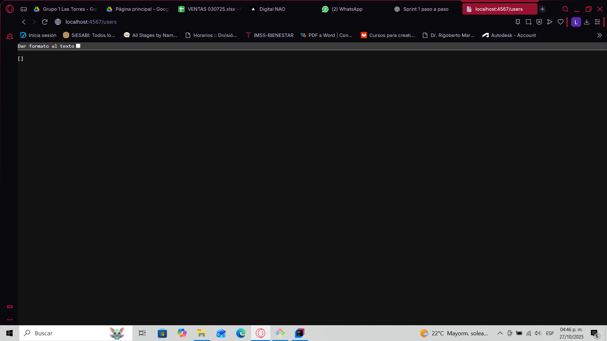
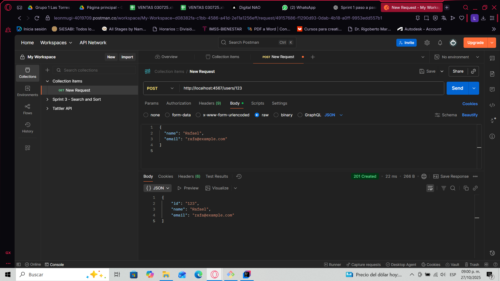
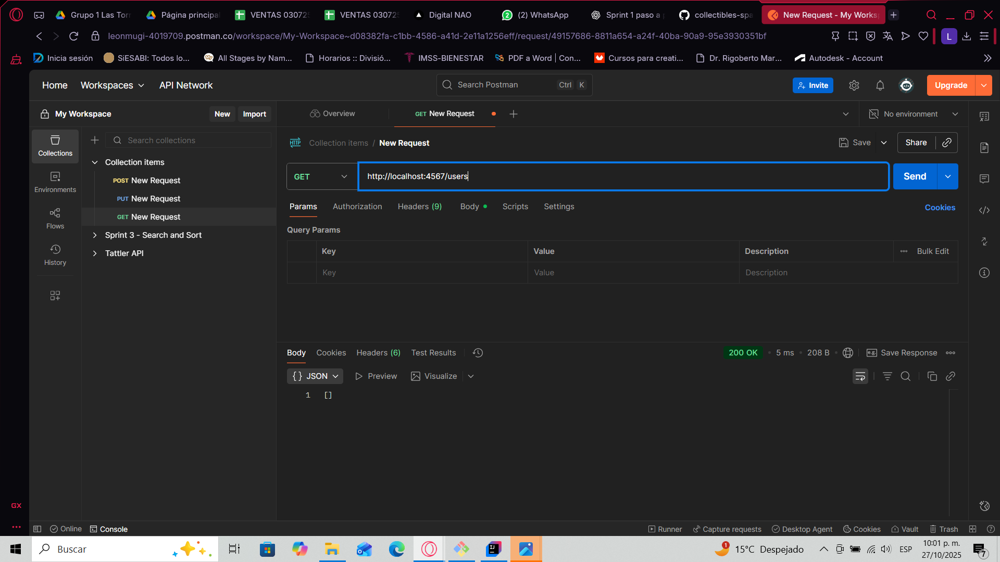
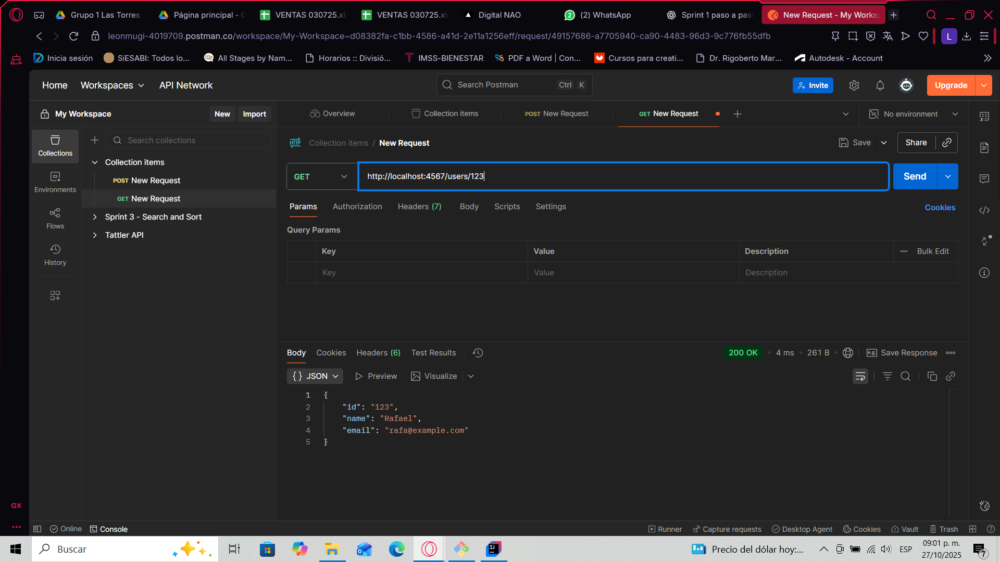
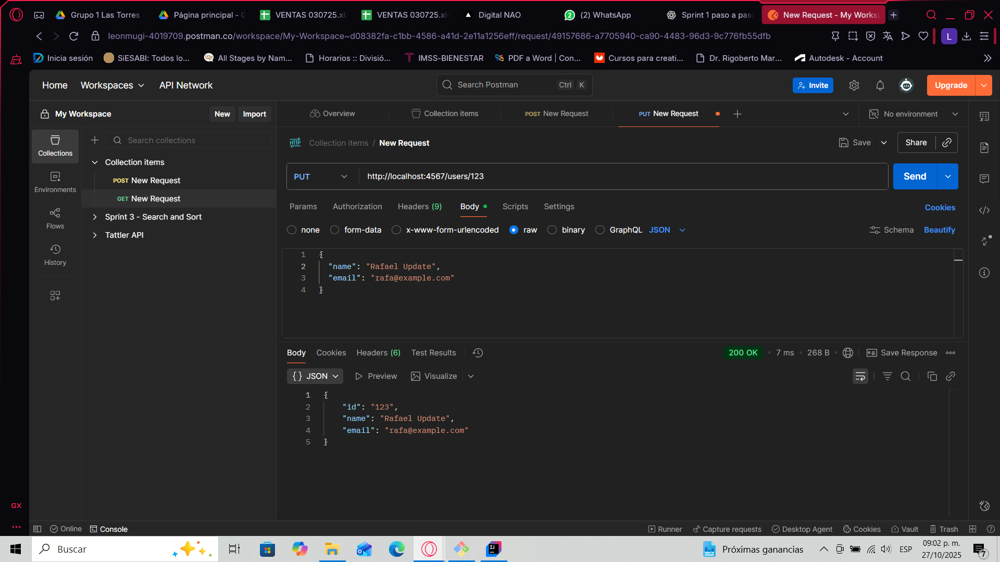
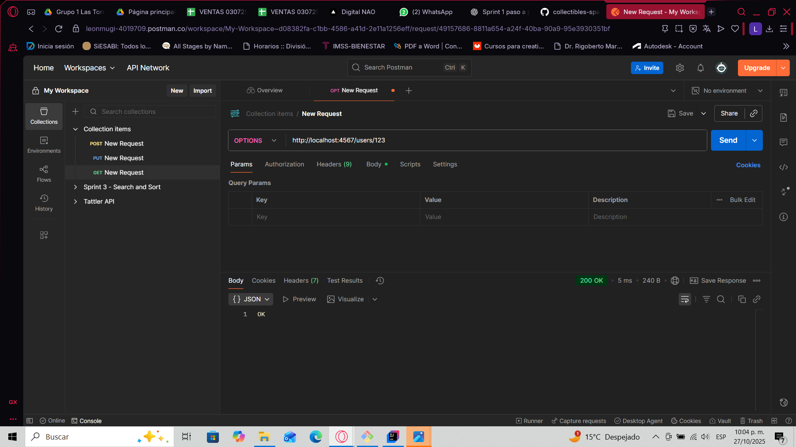
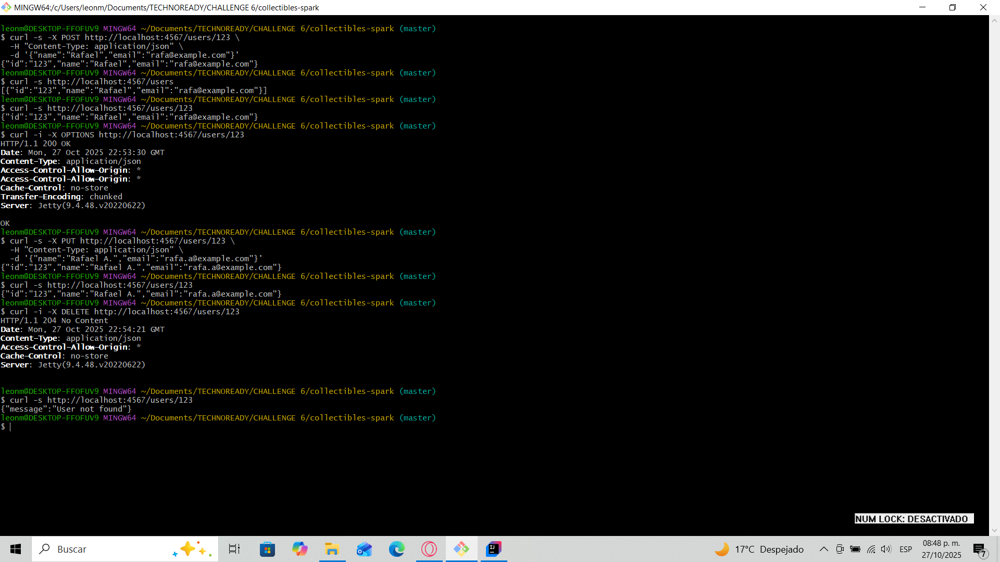
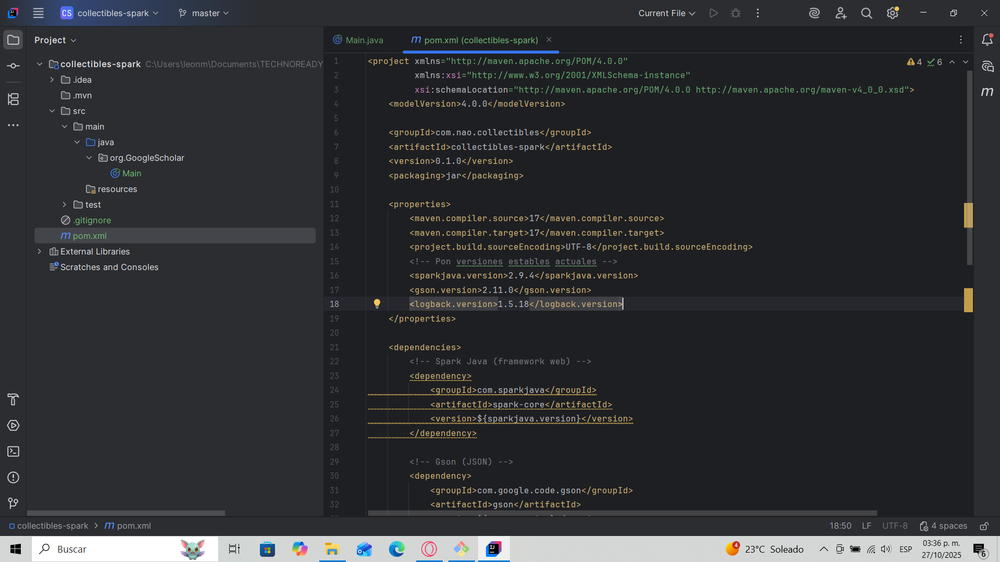
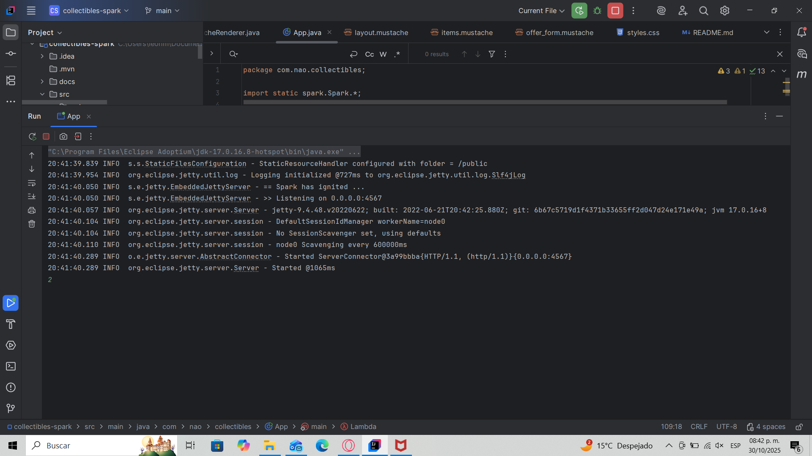

# 🧾 Collectibles Spark API

## 🏗️ Project Overview

**Collectibles Spark API** is a web service developed in **Java** using the **Spark Framework**, designed to manage collectible items and users in an online store scenario.  
This project represents the first stage (Sprint 1) of a three-phase challenge focused on building a complete web application that streamlines Java web development by reducing configuration files through the use of Spark’s minimalist microframework.

The goal of Sprint 1 is to implement a functional **RESTful API** capable of handling user operations with complete CRUD functionality (Create, Read, Update, Delete) using HTTP routes and JSON responses.

---

## 🧠 Competence and Learning Integration

This project demonstrates the **implementation of Spark Framework** within a Maven-based environment, applying Java web development principles to create modular, maintainable, and scalable applications.

It integrates the following areas of knowledge:

- **Java OOP principles** (encapsulation, classes, and methods)
- **HTTP routing and REST design**
- **API development using Spark Java**
- **Dependency management with Maven**
- **Logging using Logback**
- **Data serialization with Gson**

Through this challenge, I learned to create an API from scratch, manage dependencies, configure routes, and handle requests independently — reflecting **C2-level mastery** as defined in the evaluation rubric.

---

## ⚙️ Technical Configuration

### 🧩 Maven Setup

The project was configured as a Maven application with the following dependencies:

```xml
<dependencies>
  <dependency>
    <groupId>com.sparkjava</groupId>
    <artifactId>spark-core</artifactId>
    <version>2.9.4</version>
  </dependency>

  <dependency>
    <groupId>com.google.code.gson</groupId>
    <artifactId>gson</artifactId>
    <version>2.10.1</version>
  </dependency>

  <dependency>
    <groupId>ch.qos.logback</groupId>
    <artifactId>logback-classic</artifactId>
    <version>1.2.13</version>
  </dependency>
</dependencies>
```

✅ **Why Spark?**  
Because it eliminates XML configuration files and boilerplate code, allowing fast API setup using concise Java functions.

✅ **Why Gson?**  
To serialize and deserialize JSON responses, enabling consistent REST communication.

✅ **Why Logback?**  
To log HTTP activity and exceptions, enhancing debugging and traceability.

---

## 🚀 Running the Project

### ▶️ From IntelliJ IDEA
1. Open `App.java`.
2. Run → **Run 'App.main()'**
3. Access `http://localhost:4567/users`

### ▶️ From Terminal
```bash
mvn clean package
java -jar target/collectibles-spark-0.1.0.jar
```

Server starts at:
```
== Spark has ignited ...
>> Listening on 0.0.0.0:4567
```

---

## 🔀 Route Definition

According to Spark’s documentation, each route consists of **three parts: a verb, a route, and a callback**.

| HTTP Verb | Route | Description |
|------------|--------|--------------|
| `GET` | `/users` | Retrieves all users |
| `GET` | `/users/:id` | Retrieves a user by ID |
| `POST` | `/users/:id` | Creates a new user |
| `PUT` | `/users/:id` | Updates user information |
| `OPTIONS` | `/users/:id` | Checks if a user exists |
| `DELETE` | `/users/:id` | Deletes a specific user |
| `GET` | `/health` | Health check route (returns `OK`) |

Each route returns a **JSON-formatted response**, structured through **Gson serialization**, ensuring lightweight data handling.

---

## 💡 Example Requests

### 🧠 Create User
```bash
curl -X POST http://localhost:4567/users/123   -H "Content-Type: application/json"   -d '{"name":"Rafael","email":"rafa@example.com"}'
```

### 📋 Get All Users
```bash
curl http://localhost:4567/users
```

### 🧾 Update User
```bash
curl -X PUT http://localhost:4567/users/123   -H "Content-Type: application/json"   -d '{"name":"Rafael A.","email":"rafa.a@example.com"}'
```

### ❌ Delete User
```bash
curl -X DELETE http://localhost:4567/users/123
```

**Browser evidence:**  
Accessing `http://localhost:4567/users` shows the JSON list `[ ]` initially, and then displays the created user object after a POST operation.

---

## 🧱 Project Structure

```
collectibles-spark/
│
├── src/
│   ├── main/
│   │   ├── java/com/nao/collectibles/
│   │   │   ├── model/User.java
│   │   │   ├── store/UserStore.java
│   │   │   └── App.java
│   │   └── resources/logback.xml
│   └── test/
├── pom.xml
└── README.md
```

- `App.java`: Contains main method and route definitions.  
- `UserStore.java`: Handles in-memory user CRUD operations.  
- `User.java`: Model class defining user structure.  
- `logback.xml`: Manages log output.  
- `pom.xml`: Dependency management and build configuration.

---

## 🧩 Exception and Error Handling

Implemented using Spark’s built-in mechanisms:

```java
notFound((req, res) -> {
  res.type("application/json");
  return gson.toJson(Map.of("message", "Route not found"));
});

internalServerError((req, res) -> {
  res.type("application/json");
  return gson.toJson(Map.of("message", "Internal server error"));
});
```

✅ Ensures descriptive error responses instead of generic 404/500 pages.

---

## 🌍 Innovation and Impact

### ⚙️ Technical Innovation
This project integrates Spark’s lightweight framework to minimize configuration overhead, drastically improving setup time and readability compared to traditional Java EE approaches.

### 🌐 Educational Impact
The project demonstrates how microframeworks can simplify backend development for beginners while maintaining professional-level API standards.

### 🧩 Future Expansion
- Persistent database integration (SQLite/MySQL)
- Real-time price updates via WebSockets
- Frontend templates using Mustache

---

## 📊 Impact Analysis

| Sphere | Description |
|---------|--------------|
| **Technical** | Simplifies the Java web app workflow using Spark, reducing boilerplate code. |
| **Educational** | Enhances understanding of REST API fundamentals, JSON serialization, and backend routing. |
| **Professional** | Prepares for full-stack integration and deployment pipelines in real-world projects. |
| **Social** | Contributes to the development of accessible e-commerce prototypes for small collectors and entrepreneurs. |

---

## 🧠 Lessons Learned

- How to configure Maven for dependency management.  
- Defining routes and callbacks in Spark.  
- Testing REST endpoints with `curl`, Postman, and browser.  
- Understanding in-memory storage vs. persistent databases.  
- Importance of structured documentation for project evaluation.

---

## 📷 Evidencias – Sprint 1

| Figura | Acción / Descripción | Evidencia |
|---:|---|---|
| **Fig. 1** | **Servidor iniciado** – Spark escuchando en `:4567` |  |
| **Fig. 2** | **GET /users (vacío)** en navegador |  |
| **Fig. 3** | **POST /users/123** en Postman con body JSON |  |
| **Fig. 4** | **GET /users** (lista con usuario creado) |  |
| **Fig. 5** | **GET /users/123** (consulta por id) |  |
| **Fig. 6** | **PUT /users/123** (actualización) |  |
| **Fig. 7** | **OPTIONS /users/123** (existencia) |  |
| **Fig. 8** | **DELETE /users/123** (eliminación) |  |

### 🖼️ Referencias visuales adicionales
- **Rutas en Spark (verbo + ruta + callback)** – fragmento de `App.java`  
  

- **`pom.xml` (Spark, Gson, Logback, Shade plugin)**  
  

## 📽️ Final Deliverable Summary

- ✅ Functional REST API for user management.  
- ✅ Maven configuration and dependency setup.  
- ✅ Exception handling for 404 and 500 errors.  
- ✅ Evidence screenshots (browser, Postman, console).  
- ✅ Ready for integration with templates and WebSockets in Sprint 2.  

---

# 🧩 Fonckys Collectibles — Sprint 2 README

## 📖 Project Overview
Fonckys Collectibles is a Java Spark web application that simulates an online collectibles marketplace. During **Sprint 2**, the focus was on enhancing the application by introducing **views**, **templates**, and **exception handling** to provide a dynamic, user-friendly experience.

This sprint transformed the backend API from Sprint 1 into a visually interactive platform with Mustache templates and a responsive UI.

---

## 🚀 Sprint 2 Objectives
1. **Implement custom exception handling** for improved error responses.
2. **Create dynamic views** using Mustache templates.
3. **Develop a form** to manage item offers.
4. **Integrate CSS styling** for a modern and responsive layout.
5. **Test and deploy** the web interface on `localhost:4567`.

---

## 🧱 Project Structure
```
src/
└── main/
├── java/
│ └── com/nao/collectibles/
│ ├── App.java
│ ├── errors/
│ │ ├── ApiError.java
│ │ ├── BadRequestException.java
│ │ └── NotFoundException.java
│ ├── model/
│ └── store/
└── resources/
├── public/css/styles.css
├── templates/
│ ├── layout.mustache
│ ├── items.mustache
│ └── offer_form.mustache
└── logback.xml
```

---

## ⚙️ Core Features Implemented

### 🧩 1. Exception Handling
Custom exceptions were added to improve error messages:
```java
exception(BadRequestException.class, (ex, req, res) -> {
    res.type("application/json");
    res.status(400);
    res.body(gson.toJson(new ApiError(ex.getMessage(), "BAD_REQUEST")));
});
```
These ensure meaningful feedback when invalid inputs or missing routes occur.

### 💻 2. Dynamic Mustache Templates
- `layout.mustache`: main structure of the page (header, footer, navigation).
- `items.mustache`: displays all collectibles dynamically.
- `offer_form.mustache`: allows users to make offers for items.

### 🎨 3. Responsive CSS Design
Created a full custom UI with:
- Animated header and icons.
- Gradient backgrounds.
- Floating cards for each collectible item.

### 🧠 4. Web Form Handling
A POST form was implemented for submitting offers with validation:
```html
<form method="post" action="/items/{{id}}/offers">
    <input type="number" step="0.01" name="amount" required min="0.01">
    <input type="text" name="bidder" required maxlength="60">
    <button type="submit">Enviar Oferta</button>
</form>
```

### 🌐 5. Routes Overview
| Route | Method | Description |
|-------|---------|-------------|
| `/items` | GET | Displays all collectible items |
| `/items/:id/offer` | GET | Loads offer form for specific item |
| `/items/:id/offers` | POST | Submits new offer |

---

## 🧭 Sprint 2 Summary
- **Status:** ✅ Completed
- **Key Deliverables:** Mustache templates, CSS design, functional offer form.
- **Repository:** [GitHub Repository Link](#)
- **Demo:** `http://localhost:4567/items`

This sprint achieved full UI integration, bridging backend logic with dynamic web rendering and user interaction.

---
## 🧪 Test Evidence

| Figure | Action / Description | Evidence |
|:---:|:---|:---|
| **Fig. 1** | **Server running successfully on port 4567** |  |
| **Fig. 2** | **View all collectible items** (`/items`) |  |
| **Fig. 3** | **Open form to create a new item** (`/items/new`) |  |
| **Fig. 4** | **Open offer form for an existing item** (`/items/:id/offer`) |  |
| **Fig. 5** | **Submit offer (POST)** showing validation and success feedback |  |
| **Fig. 6** | **Exception handling test** (route not found / 404) |  |
| **Fig. 7** | **Improved layout design and UI rendering** |  |

---

## 🔧 Technologies Used

- **Java 17**
- **Spark Framework**
- **Mustache Template Engine**
- **Gson (Google JSON Library)**
- **HTML5, CSS3 (Custom styling with animations)**
- **Maven**

---

## 🧩 Next Steps — Sprint 3 Preview
1. Implement **filtering** of items by category or price.
2. Add **real-time updates** via WebSockets.
3. Finalize documentation and prepare demo video for submission.

---

## 👨‍💻 Authors
**Eduardo Antonio Gutierrez Carreon**
**Leonel Campos Valdés**

